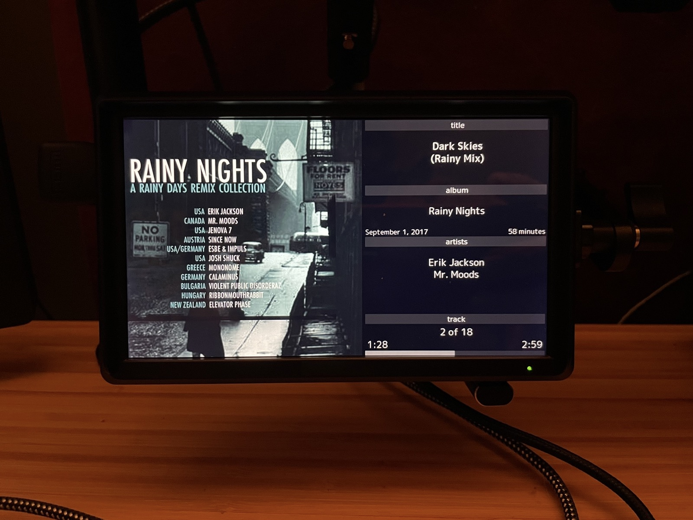
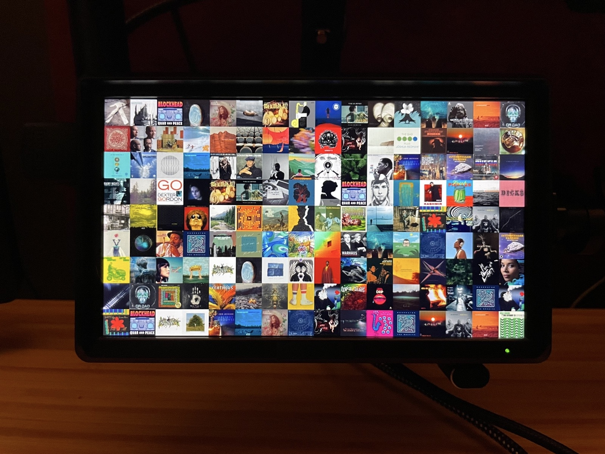
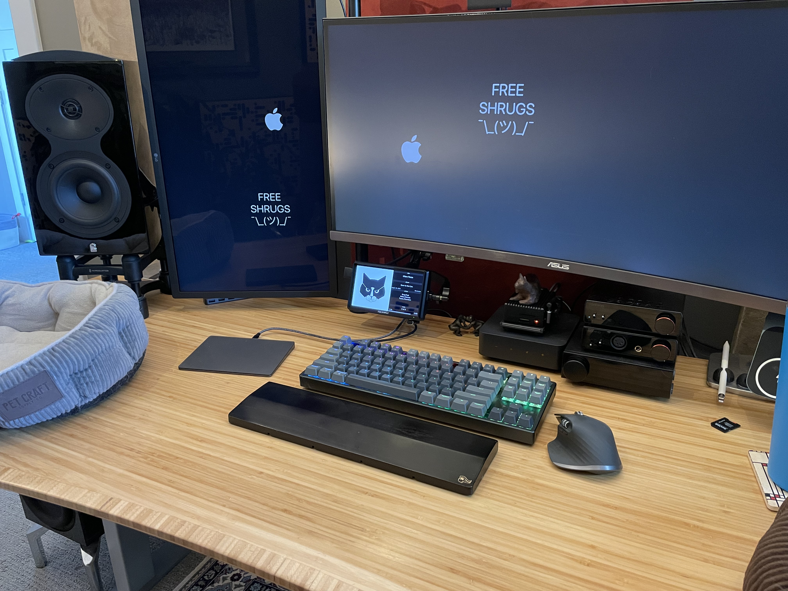

# NowPlayingDisplay
NowPlayingDisplay shows full screen album art and information on an HDMI screen for your currently playing music. It is universal (player agnostic), API driven, and written in python. NowPlayingDisplay requires a client to push data to keep the display updated. This repo has client integrations available for Home Assistant, WiiM, and TIDAL desktop on the Mac. The Home Assistant integration means it works with any music player that works with Home Assistant. 

## The Display 

Below are pictures of NowPlayingDisplay running on a 6" HDMI screen. The ablum art fills the full left square, while the remaining space to the right contains organized information and a progress bar for the currently playing title. The album art and metadata is all sourced from the iTunes music service API. 



After a few minutes of being idle and not playing music, NowPlayingDisplay runs a built-in screen saver that's a grid of album covers sourced from the music you've played. The grid updates a small percentage of the covers randomly every few seconds. A 16x9 display will have 16 albums across by 9 albums high (144 albums). Until you have listened to 144 albums, covers will be repeated in the screensaver. Once that threshold is crossed, the screensaver keeps the artwork well randomized and unique.




## Why?

I wanted my own small stand-alone LCD display on my desk to do this one simple stand-alone task, with the specific ability to integrate any player I wanted over time. I now run it on my desk and feed the display from several different sources, with TIDAL desktop on the Mac being the primary source.

## Inspiration

* The [WiiM-HDMI](https://github.com/retired-guy/WiiM-HDMI) project inspired a lot of NowPlayingDisplay, and I initially started with a fork of this code.
* I also repurposed and modified a bunch of code from [get\_cover\_art](https://github.com/regosen/get_cover_art) for retrieving the album art and talking to Apple Music.

## How It Works
NowPlayingDisplay on it's own doesn't do anything until there is a client sending it data. The client is a process that commincates with an actual music player, and then regularily posts the track title, album title, artist(s), track duration, elapsed time, and active/stopped/paused status to the NowPlayingDisplay server, which is then used to drive the state of the display. In practice, the display responds very quickly and feels like it's directly connected to the music player.

For the album art and metadata, NowPlayingDisplay searches Apple Music and then pulls from there to minimize the work for the client. NowPlayingDisplay also syncs the elapsed time provided to an internal counter to drive the progress bar and update elapsed time on the display every second, so the client doesn't need to constantly send updates. 

## Hardware
NowPlayingDisplay uses very little CPU and is platform independant (it even runs on my Mac running Sonoma). A Raspberry pi zero would be more than enough. I run it on a pi4 (overkill) with a 6 inch HDMI display:



## Running NowPlayingDisplay

To run NowPlayingDisplay, you need first set up python and install the [requirements.txt](requirements.txt) for this project. Once that is done, update the [npsettings.py](npsettings.py) file with your player info. run the command below from inside the NowPlayingDisplay folder:

`python3 now_playing.py`

Once NowPlayingDisplay is running, it is ready receive data from clients.


## NowPlayingDisplay Clients & Using the API

**Home Assistant:** Any music player in Home Assistant can drive the display using the rest command in the [configuration.yml](homeassistant/configuration.yml) file, and the automation found in [automation.yml](homeassistant/automation.yml)

**TIDAL on Mac:** The TIDAL desktop app on the Mac is what I use, which is why [`tidal_client.py`](tidal_client.py) is the first NowPlayingDisplay client I created. More info is below on how to run this client.

**WiiM:** I also own a WiiM Pro, so armed with [WiiM-HDMI](https://github.com/retired-guy/WiiM-HDMI) as an example, making a WiiM client for NowPlayingDisplay was very easy. This client can run on the same host as the display itself, or pretty much anywhere else on your local network. Just run it with `python3 wiim_client.py`, and make sure you use the same npsettings.py file as the server.

Clients update NowPlayingDisplay by submitting http posts to /update-now-playing on port 5432 the host running it:

`http://x.x.x.x:5432/update-now-playing`

The JSON payloads must include all of the folowing fields (example data):

```
{
    "album": "LOFI & CHILL VOL.2",
    "artist": ["Millennium Jazz Music", "Aempoppin"],
    "duration": "2:14",
    "elapsed": "0:27",
    "state": "active",
    "title": "Constant",
    "npclient": "my-hostname"
}
```
At a minimum, the client needs to send updates to the display when the track changes or the player is stopped/paused/started, and then at intervals less than 1 minute to keep everything in sync. The Tidal client sends updates every 10s

### Using the TIDAL client

The `tidal_client.py` client monitors the TIDAL desktop application log file for changes in order to detect start/stop/pause actions, which then triggers immediate polling the TIDAL desktop UI for player data. To poll for the player data, it uses a small external AppleScript to scrape the TIDAL application user interface, directly talking to the interface objects to collect it's data. It then posts the required JSON data to the NowPlayingDisplay.

Make sure you update the npsettings.py file, and then use the command below from inside the NowPlayingDispay folder:

`python3 tidal_client.py`

The first time this runs, you'll need to deal with Apple's security stuff, allowing the [`tidal-now-playing.applescript`](tidal-now-playing.applescript) AppleScript and your terminal to access the TIDAL user interface, as well as allow it access to read/monitor the log file. Generally this involves trying to run it first, and then following the security prompts and opening System Preferences.

Known issues with `tidal_watcher.py`: 
* Cannot properly update if TIDAL is "Hidden" (as in command + H) or minimized or when the Apple screensaver is running. This is a limitation of using GUI scripting to scrape the now playing data.

### Writing Your Own Client

Three clients are provided that should prove to be good examples to creaate your own. The main concept is any time your player state changes, other than the passage of time, have the client send an update. You want your client pushing data to the display server at least once every 10s, and overly agressive (less than 1s) is not good as it can make the elapsed time flow less smoothly.